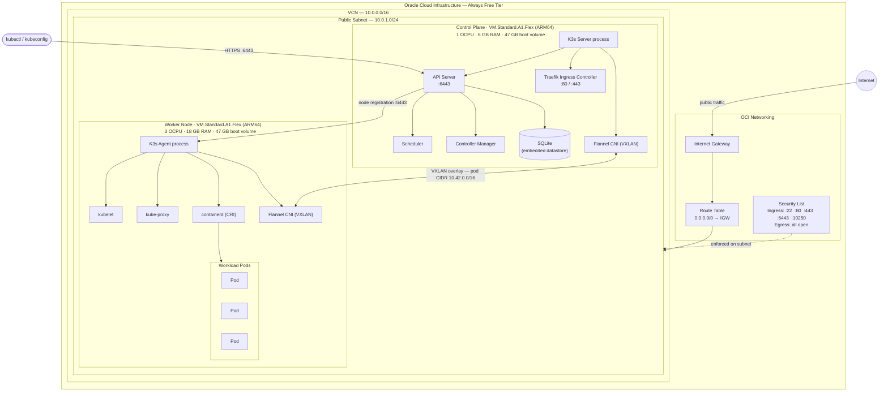

# Kubernetes on Oracle Cloud Free Tier



Automatically deploy a K3s Kubernetes cluster on Oracle Cloud Infrastructure's always-free tier using Terraform.

## Overview

This project creates a production-ready Kubernetes cluster on OCI's free tier:

- **2 ARM-based compute instances** (VM.Standard.A1.Flex)
  - Control plane: 1 OCPU, 6 GB RAM
  - Worker node: 3 OCPU, 18 GB RAM
- **K3s Kubernetes** installed automatically via cloud-init
- **Complete networking** (VCN, Internet Gateway, Security Lists)
- **Zero cost** - stays within OCI always-free tier limits

## Architecture

```
Internet
    |
    v
[Internet Gateway]
    |
    v
[Public Subnet 10.0.1.0/24]
    |
    +-- [Control Plane] 1 OCPU, 6GB RAM (K3s Server)
    |
    +-- [Worker Node]   3 OCPU, 18GB RAM (K3s Agent)
```

## Prerequisites

### 1. Oracle Cloud Account

Sign up for a free Oracle Cloud account: https://www.oracle.com/cloud/free/

The free tier includes:
- 4 ARM-based OCPUs and 24 GB RAM (always free)
- 200 GB total block storage
- Networking and bandwidth

### 2. Install Required Tools

**Terraform** (>= 1.0)
```bash
# macOS
brew install terraform

# Linux
wget https://releases.hashicorp.com/terraform/1.6.0/terraform_1.6.0_linux_amd64.zip
unzip terraform_1.6.0_linux_amd64.zip
sudo mv terraform /usr/local/bin/

# Verify installation
terraform version
```

**OCI CLI** (Optional but helpful)
```bash
# macOS
brew install oci-cli

# Linux
bash -c "$(curl -L https://raw.githubusercontent.com/oracle/oci-cli/master/scripts/install/install.sh)"

# Configure OCI CLI
oci setup config
```

### 3. Generate SSH Keys

If you don't already have SSH keys:

```bash
ssh-keygen -t rsa -b 4096 -f ~/.ssh/oci_id_rsa
```

## OCI Account Setup

### Step 1: Find Your Tenancy OCID

1. Log in to OCI Console: https://cloud.oracle.com/
2. Click on your **Profile** (top right) → **Tenancy**
3. Copy the **OCID** (starts with `ocid1.tenancy.oc1..`)

### Step 2: Find Your User OCID

1. Click on your **Profile** (top right) → **User Settings**
2. Copy the **OCID** (starts with `ocid1.user.oc1..`)

### Step 3: Generate API Key

1. In User Settings, scroll to **API Keys** section
2. Click **Add API Key**
3. Generate a new key pair:

```bash
mkdir -p ~/.oci
openssl genrsa -out ~/.oci/oci_api_key.pem 2048
openssl rsa -pubout -in ~/.oci/oci_api_key.pem -out ~/.oci/oci_api_key_public.pem
```

4. Click **Paste Public Key** and paste the contents of `~/.oci/oci_api_key_public.pem`
5. Click **Add**
6. Copy the **Fingerprint** (format: `xx:xx:xx:xx:...`)

### Step 4: Find Your Compartment OCID

**Option A: Use root compartment (simplest)**
- Your root compartment OCID is the same as your tenancy OCID

**Option B: Create a new compartment**
1. Navigate to **Identity** → **Compartments**
2. Click **Create Compartment**
3. Name it (e.g., "k3s-cluster")
4. Copy the **OCID**

### Step 5: Choose a Region

Select a region close to you:
- `us-ashburn-1` (US East - Virginia)
- `us-phoenix-1` (US West - Arizona)
- `eu-frankfurt-1` (Germany)
- `ap-tokyo-1` (Japan)
- `uk-london-1` (United Kingdom)

Full list: https://docs.oracle.com/en-us/iaas/Content/General/Concepts/regions.htm

## Deployment

### Step 1: Clone/Download This Project

```bash
git clone <your-repo-url>
cd terraform-k8s-oci-free
```

Or download and extract the files to a directory.

### Step 2: Configure Variables

Copy the example variables file:

```bash
cp terraform.tfvars.example terraform.tfvars
```

Edit `terraform.tfvars` with your OCI credentials:

```hcl
tenancy_ocid     = "ocid1.tenancy.oc1..aaaaa..."
user_ocid        = "ocid1.user.oc1..aaaaa..."
fingerprint      = "xx:xx:xx:xx:xx:xx:xx:xx:xx:xx:xx:xx:xx:xx:xx:xx"
private_key_path = "~/.oci/oci_api_key.pem"
region           = "us-ashburn-1"
compartment_ocid = "ocid1.compartment.oc1..aaaaa..."
ssh_public_key   = "ssh-rsa AAAAB3Nza... your-email@example.com"
```

**Important**: Replace all values with your actual OCI credentials.

### Step 3: Initialize Terraform

```bash
terraform init
```

This downloads the required providers (OCI and Random).

### Step 4: Review the Plan

```bash
terraform plan
```

Review the resources that will be created:
- 1 VCN (Virtual Cloud Network)
- 1 Internet Gateway
- 1 Route Table
- 1 Security List
- 1 Subnet
- 2 Compute Instances (control plane + worker)

### Step 5: Deploy the Cluster

```bash
terraform apply
```

Type `yes` when prompted.

Deployment takes approximately **5-10 minutes**:
- Terraform creates infrastructure (~2 minutes)
- Cloud-init installs K3s on both nodes (~3-8 minutes)

### Step 6: Verify Deployment

After `terraform apply` completes, you'll see output with connection information.

**Check if K3s is running on control plane:**

```bash
# Use the command from terraform output
ssh opc@<control-plane-public-ip> 'sudo /usr/local/bin/kubectl get nodes'
```

You should see both nodes in `Ready` state:
```
NAME                STATUS   ROLES                  AGE   VERSION
k3s-control-plane   Ready    control-plane,master   5m    v1.28.x+k3s1
k3s-worker          Ready    <none>                 3m    v1.28.x+k3s1
```

## Post-Deployment

### Access Your Cluster Locally

1. **Retrieve the kubeconfig:**

```bash
ssh opc@<control-plane-public-ip> 'sudo cat /etc/rancher/k3s/k3s.yaml' > kubeconfig.yaml
```

2. **Edit kubeconfig.yaml** and replace `127.0.0.1` with your control plane's public IP:

```bash
# Before:
server: https://127.0.0.1:6443

# After:
server: https://<control-plane-public-ip>:6443
```

3. **Use kubectl locally:**

```bash
export KUBECONFIG=./kubeconfig.yaml
kubectl get nodes
kubectl get pods -A
```

### Deploy a Test Application

```bash
# Create an nginx deployment
kubectl create deployment nginx --image=nginx

# Expose it as a NodePort service
kubectl expose deployment nginx --port=80 --type=NodePort

# Check the NodePort assigned
kubectl get svc nginx

# Access via browser
# http://<control-plane-public-ip>:<node-port>
# or
# http://<worker-public-ip>:<node-port>
```

### Deploy with Ingress

K3s includes Traefik ingress controller by default:

```yaml
apiVersion: networking.k8s.io/v1
kind: Ingress
metadata:
  name: nginx-ingress
spec:
  rules:
  - http:
      paths:
      - path: /
        pathType: Prefix
        backend:
          service:
            name: nginx
            port:
              number: 80
```

```bash
kubectl apply -f ingress.yaml

# Access via http://<any-node-public-ip>
```

## Cluster Management

### SSH Access

```bash
# Control plane
ssh opc@<control-plane-public-ip>

# Worker node
ssh opc@<worker-public-ip>
```

### Useful Commands on Control Plane

```bash
# Get cluster nodes
sudo /usr/local/bin/kubectl get nodes

# Get all pods
sudo /usr/local/bin/kubectl get pods -A

# Check K3s service status
sudo systemctl status k3s

# View K3s logs
sudo journalctl -u k3s -f

# Check cloud-init logs
sudo cat /var/log/cloud-init-output.log
```

### Useful Commands on Worker

```bash
# Check K3s agent status
sudo systemctl status k3s-agent

# View K3s agent logs
sudo journalctl -u k3s-agent -f

# Check cloud-init logs
sudo cat /var/log/cloud-init-output.log
```

## Troubleshooting

### Worker Node Not Joining Cluster

1. **Check if control plane is ready:**
```bash
ssh opc@<control-plane-public-ip> 'sudo systemctl status k3s'
```

2. **Check worker logs:**
```bash
ssh opc@<worker-public-ip> 'sudo cat /var/log/cloud-init-output.log'
```

3. **Verify network connectivity:**
```bash
ssh opc@<worker-public-ip> 'curl -k https://<control-plane-private-ip>:6443/ping'
```

### Terraform Apply Fails - Capacity Error

If you get "Out of capacity" error:

1. Try a different availability domain:
```hcl
# In terraform.tfvars
availability_domain = 2  # or 3
```

2. Try a different region (some regions have more free tier capacity)

### SSH Connection Refused

Wait 2-3 minutes after instance creation for SSH to be ready.

### K3s Not Starting

1. Check cloud-init logs:
```bash
ssh opc@<instance-ip> 'sudo cat /var/log/cloud-init-output.log'
```

2. Check for firewall issues:
```bash
ssh opc@<instance-ip> 'sudo systemctl status firewalld'
# Should be inactive
```

### Pods Not Running

1. Check node status:
```bash
kubectl get nodes
```

2. Describe the pod:
```bash
kubectl describe pod <pod-name>
```

3. Check events:
```bash
kubectl get events --sort-by='.lastTimestamp'
```

## Cost Considerations

This setup uses only free tier resources:

| Resource | Free Tier Limit | This Project |
|----------|----------------|--------------|
| ARM OCPUs | 4 OCPUs | 4 OCPUs (1+3) |
| ARM Memory | 24 GB | 24 GB (6+18) |
| Block Storage | 200 GB | ~94 GB (47 GB × 2) |
| Public IPs | 2 | 2 |

**Cost: $0/month** (within free tier limits)

**Important**: If you modify instance sizes to exceed free tier limits, you will be charged.

## Cleanup

To destroy all resources and avoid any charges:

```bash
terraform destroy
```

Type `yes` when prompted.

This will delete:
- Both compute instances
- VCN and all networking resources
- All data on the instances

## Advanced Configuration

### Increase Worker Resources

If you want a single larger worker (using all free tier resources):

```hcl
# In terraform.tfvars
control_plane_ocpus     = 0  # Not recommended, but possible
control_plane_memory_gb = 0
worker_ocpus            = 4
worker_memory_gb        = 24
```

Note: You need at least 1 control plane node for K3s.

### Use Different K3s Version

Edit `cloud-init/k3s-server.yaml.tpl` and `cloud-init/k3s-agent.yaml.tpl`:

```bash
# Install specific version
curl -sfL https://get.k3s.io | INSTALL_K3S_VERSION=v1.28.5+k3s1 sh -s - ...
```

### Disable Traefik Ingress

If you want to use a different ingress controller, edit `cloud-init/k3s-server.yaml.tpl`:

```bash
curl -sfL https://get.k3s.io | sh -s - server \
  --write-kubeconfig-mode 644 \
  --disable traefik \
  ...
```

## Security Considerations

This setup is configured for easy access and development use. For production:

1. **Restrict SSH access** - Modify security list to allow SSH only from your IP
2. **Use private subnet** - Put worker nodes in private subnet with NAT gateway (extra cost)
3. **Enable OCI WAF** - Add Web Application Firewall for public-facing apps
4. **Rotate secrets** - Change the K3s token regularly
5. **Enable audit logging** - Configure Kubernetes audit logs
6. **Use network policies** - Implement Kubernetes network policies for pod-to-pod communication

## Limitations

- **No high availability** - Single control plane node (HA requires 3+ nodes)
- **No persistent storage** - Uses local disk only (OCI block volumes cost extra)
- **Public subnet** - All nodes have public IPs (private subnet requires NAT gateway = extra cost)
- **Basic security** - Security list allows wide access (should be restricted for production)

## Resources

- [OCI Free Tier Documentation](https://docs.oracle.com/en-us/iaas/Content/FreeTier/freetier.htm)
- [K3s Documentation](https://docs.k3s.io/)
- [Terraform OCI Provider](https://registry.terraform.io/providers/oracle/oci/latest/docs)
- [OCI Terraform Examples](https://github.com/oracle/terraform-provider-oci/tree/master/examples)

## License

This project is provided as-is for educational and development purposes.

## Contributing

Feel free to submit issues and enhancement requests!
